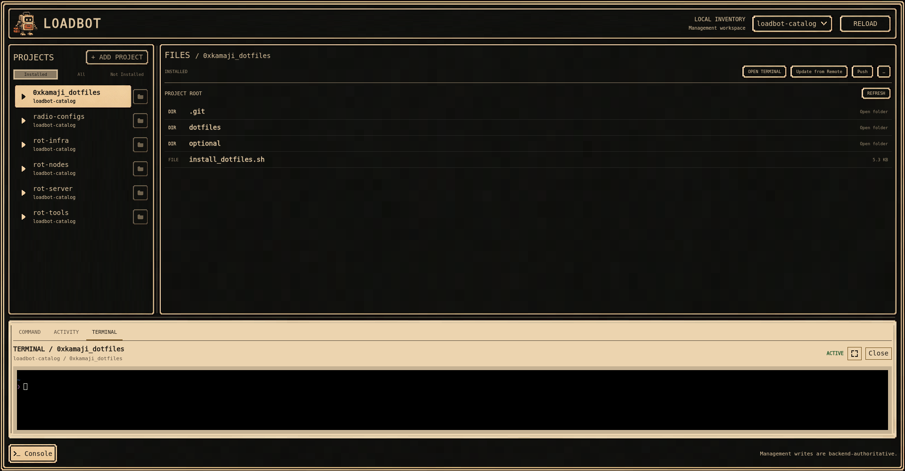

# Loadbot

Loadbot is a cross-platform GUI and CLI for managing Git-backed catalogs of projects and tools. It lets you install, update, browse, open terminals in, and manage those projects locally.



## Features

- Catalog-based project management
- Project installation and updates
- Local file browsing
- Integrated terminal sessions
- Git push and update workflows
- Desktop GUI and CLI interfaces

## Download

Download the latest build from [GitHub Releases](https://github.com/0xkamaji/loadbot/releases). On Windows, use the `setup.exe` for a normal installation or the `portable.zip` for manual use. On Linux, extract the `.tar.gz` and run `./install.sh` to install the CLI and desktop app for the current user. Git must be installed and available on `PATH`.

## CLI

Run `loadbot` without a command to open the interactive menu. Commands with optional names also prompt for a selection when used in an interactive terminal.

| Command | Purpose |
| --- | --- |
| `loadbot gui [--dev]` | Launch the desktop GUI, or its source development environment. |
| `loadbot setup [--cli\|--gui\|--all\|--repair]` | Install or repair the current release. |
| `loadbot add [NAME] [GIT_URL] [--revision REVISION] [--catalog CATALOG] [--commit] [--push]` | Add a project to a writable catalog. |
| `loadbot pull [NAME] [--catalog CATALOG]` | Install a project. |
| `loadbot update [NAME] [--catalog CATALOG]` | Fast-forward an installed project. |
| `loadbot push [NAME] [--catalog CATALOG]` | Push local project commits. |
| `loadbot remove [NAME] [--catalog CATALOG]` | Remove a local checkout but keep its catalog entry. |
| `loadbot reinstall [NAME] [--catalog CATALOG]` | Replace a local checkout with a fresh clone. |
| `loadbot list` | List catalog projects. |
| `loadbot path [NAME] [--catalog CATALOG]` | Print a project's local path. |
| `loadbot status [NAME] [--catalog CATALOG]` | Show a project's local Git status. |
| `loadbot run [SHORTCUT]` | Browse and launch an installed file or saved shortcut. |
| `loadbot shortcut` | Open shortcut management. |
| `loadbot shortcut add` | Add a shortcut interactively. |
| `loadbot shortcut list` | List saved shortcuts. |
| `loadbot shortcut remove [NAME] [--yes]` | Remove a saved shortcut. |
| `loadbot catalog` | Open catalog setup and management. |
| `loadbot catalog add [NAME] [GIT_URL] [--writable]` | Register and clone a catalog. |
| `loadbot catalog list` | List registered catalogs. |
| `loadbot catalog sync [NAME]` | Fast-forward a catalog. |
| `loadbot catalog status [NAME]` | Show catalog status. |
| `loadbot catalog path [NAME]` | Print a catalog's local path. |
| `loadbot catalog migrate NAME GIT_URL` | Migrate legacy local definitions into a catalog. |
| `loadbot --help` / `loadbot --version` | Show CLI help or version information. |

## Local data

```text
Linux data:     ~/.local/share/loadbot/
Linux config:   ~/.config/loadbot/

Windows data:   %LOCALAPPDATA%\loadbot\
Windows config: %APPDATA%\loadbot\
```

`LOADBOT_HOME` overrides the data root, and `LOADBOT_CONFIG_HOME` overrides the directory containing `shortcuts.toml`.

## 🤖 AI-assisted development
See [`docs/`](docs/) for implementation details, architecture notes, setup instructions, and GUI development documentation.

This project was built with substantial AI coding assistance. I defined the architecture, constraints, workflows, interfaces, safety boundaries, and acceptance criteria.\
The robots supplied a lot of the typing. 🛠️\
Use accordingly.
